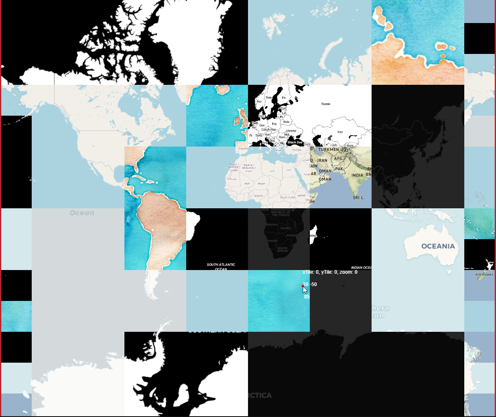

# Описание

Эксперименты с самостоятельной загрузкой тайлов по координатам. Формируем запрос по формулам.

Полный контроль над масштабом, тайлом и выбором сервера карты.

Пример

## Интерфейс

- `LClick + Drag` — загрузка тайлов под курсором
- `MClick + Drag` — спещение холста
- `MWheel` — изменение масштаба
- `+` — увеличить разрешение тайлов
- `-` — уменьшить разрешение тайлов

## 