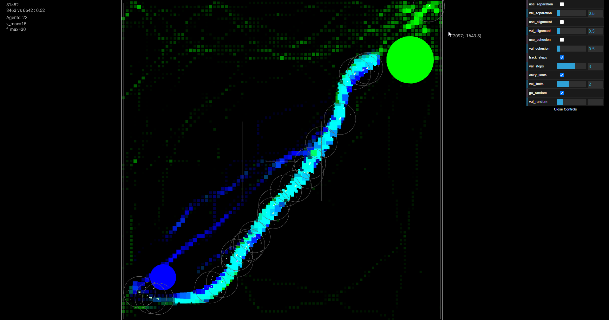
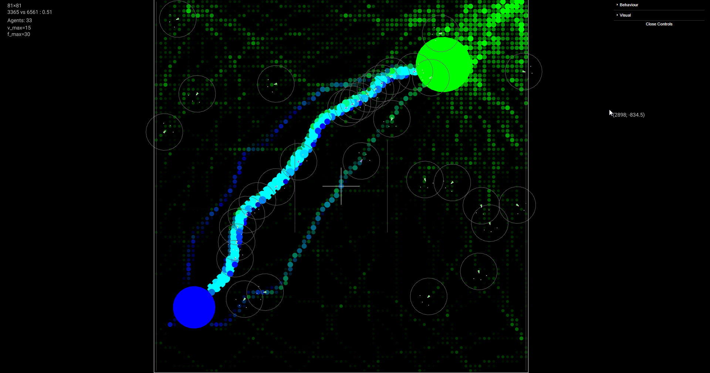

# Описание

Агентная модель. Настроена на симуляцию поведения «муравьев»: поиск пищи и доставка её в дом.

## Управление

- `ALT + Lclick` — поставить дом
- `CTRL + Lclick` — поставить пищу
- `SHIFT + Lclick` — удалить пищу
- `Mclick'n'drag` — панорамирование
- `Mwheel` — масштабирование

## Модели поведения

Реализованы следующие модели поведения:
- Разделение (separation)
- Выравнивание (alignment)
- Притягивание (cohesion)
- Слежение за следами (track_steps)
- Соблюдение границ моделирования (obey_limits)
- Выбор случайного направления (go_random)

Внутри класса агента есть возможность настройки весового коэффициента вклада каждого поведения в общее поведение. Варьируя различными показателями можем повышать или уменьшать значимость следа, лиоб направление домой и любые другие модели в принятии окончательного решения.

# Реализация

Следы визуально похожы на растр, но реализованы как отдельные объекты, формируя таки образом подобие разреженной матрицы. Ведется подсчет степени разреженности.

При таком подходе есть возможность произвольной отрисовки каждого следа — квадратом, кругом, растром...